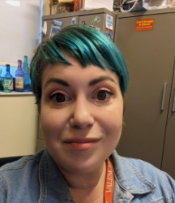

<!DOCTYPE html>
<html>
<head>
  <title>Emilie Buckley CV</title>
  
</head>
<body>

  

  <h1>Emilie Buckley, MLS, MMC</h1>
  <h2>Faculty Librarian, Valencia College</h2>

  

  <h3>About Me</h3>
    I am a seasoned academic librarian with over ten years experience. I'm currently at Valencia College as a tenured faculty librarian as well as a new student experience and speech instructor. Past institutions I've worked at include the University of Central Florida and Hillsborough Community College. I'm currently a PhD student at the University of Central Florida in the Text and Technology program. My past educational experience includes a master of mass communication at South Dakota State University and a master of library science at Clarion University.
  

  <h3>Research Interests</h3>
  <ul>
    <li>Media and culture studies</li>
    <li>Queer studies</li>
    <li>Game Studies</li>
  </ul>

  <h2>Conference Presentations</h2>
  <ul>
    <li>Undercover Librarian: Experiencing Biology From the Student Perspective, Florida Association of College and Research Libraries, 2022</li>
  </ul>

  <h3>Contact</h3>
  <ul>
    <li>Email: ebuckley3@valenciacollege.edu</li>
    <li>Phone: (813)240-7773</li>
    <li>Office Location: Lake Nona Campus 330G</li>
  </ul>

  <h3>Skills</h3>
  <ul>
    <li>Academic research</li>
    <li>Teaching</li>
    <li>Digital art</li>
    <li>Instructional design</li>
  </ul>

  <h3>Find Me Online</h3>
  <ul>
    <li><a href="https://www.linkedin.com/in/emiliebuckley/" style="color: white;">LinkedIn</a></li>
  </ul>

  <footer>
    Created by Emilie Buckley, 2023
  </footer>

</body>
</html>
