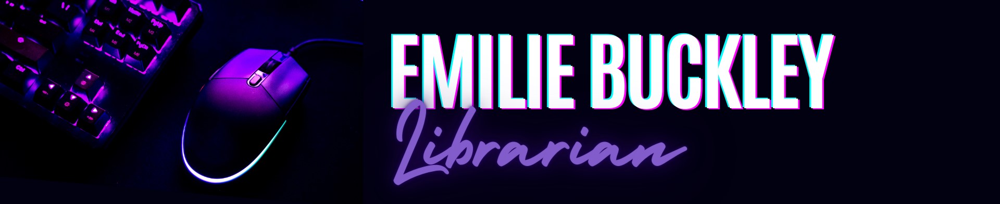
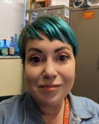

<!DOCTYPE html>
<html>
<head>
  <title>Emilie Buckley CV</title>
  
</head>
<body>

  

<body>
    

    <h1>Emilie Buckley, MLS, MMC</h1>
    

</body>

  
 
  <h3>Contact</h3>
  <ul>
    <li>Email: <a href="mailto:ebuckley3@valenciacollege.edu">ebuckley3@valenciacollege.edu</a></li>
    <li>Phone: (813)240-7773</li>
    <li>Office Location: Lake Nona Campus 330G</li>
  </ul>
 
  <h3>About Me</h3>
    I'm a seasoned academic librarian with over ten years experience. I'm currently at Valencia College as a tenured faculty librarian as well as a new student experience and speech instructor. Past institutions I've worked at include the University of Central Florida and Hillsborough Community College. I'm currently a PhD student at the University of Central Florida in the Text and Technology program. My past educational experience includes a master of mass communication at South Dakota State University and a master of library science at Clarion University.
  
 
  <h3>Education</h3>
  <ul>
    <li>University of Central Florida, Text and Technology PhD, 2023-Present</li>
    <li>South Dakota State University, Mass Media Communication, 2017-2022</li>
    <li>Clarion University, Master of Library Science, 2012-2013</li>
    <li>Governors State University, Interdisciplinary Studies, 2009-2011</li>
    <li>College of DuPage, General Studies, 2004-2006</li>
  </ul>

  <h3>Employment</h3>
  <ul>
    <li>Valencia College, Faculty Librarian 2017-Present</li>
    <li>University of Central Florida, Librarian 2016-2017</li>
    <li>Hillsborough Community College, Librarian 2014-2016</li>
    <li>Self-Determination Theory Institute, Research Assistant, Contractor, 2014-2014</li>
    <li>Hillsborough County Public Library System, Library Technical Assistant, 2010-2012</li>
  </ul>

  <h3>Research Interests</h3>
  <ul>
    <li>Media and culture studies</li>
    <li>Queer studies</li>
    <li>Game Studies</li>
  </ul>

  <h3>Conference Presentations</h3>
  <ul>
    <li>Undercover Librarian: Experiencing Biology From the Student Perspective, Florida Association of College and Research Libraries, 2022</li>
    <li>AI in the Classroom, Valencia College Learning Day, 2022</li>
    <li>Teaching Open Education Resources Through Library Partnerships, Association of College and Research Libraries OER Conference, 2021</li>
  </ul>

  <h3>Skills</h3>
  <ul>
    <li>Academic research</li>
    <li>Teaching, Student Success Skills, Speech</li>
    <li>Digital art</li>
    <li>Instructional design</li>
    <li>Creative Thinking</li>
  </ul>

  <h3>Certifications</h3>
  <ul>
    <li>Open Education Resources Institute, Association of College and Research Universities, 2021</li>
    <li>LGBTQ+ Safe Zone Training, Valencia College, 2020</li>
    <li>Destinations, Creativity in the Classroom and Beyond, 2018</li>
  </ul>

  <h3>Awards</h3>
  <ul>
    <li>Outstanding Mass Media Communication Student, South Dakota State University, 2022</li>
    <li>Tenure, Valencia College, 2022</li>
  </ul>

  <h3>Find Me Online</h3>
  <ul>
    <li><a href="https://www.linkedin.com/in/emiliebuckley/">LinkedIn</a></li>
  </ul>
 
 
 
 
  <footer>
    Created by Emilie Buckley, 2023
  </footer>

</body>
</html>
