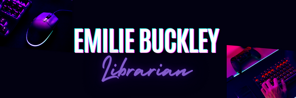

# Emilie Buckley, MLS, MMC
## Faculty Librarian, Valencia College

### About Me

I am a seasoned academic librarian with over ten years experience. I'm currenly at Valencia College as a tenured faculty librarian as well as a new student experience and speech instructor. Past institutions I've worked at include the University of Central Florida and Hillsborough Community College. I'm currently a PhD student at the University of Central Florida in the Text and Technology program. My past educational experience includes a master of mass communication at South Dakota State University and a master of library science at Clarion University. 

### Research Interests
* Media and culture studies
* Queer studies
* Game Studies

### Contact
* Email: ebuckley3@valenciacollege.edu
* Phone: (813)240-7773
* Office Location: Lake Nona Campus 330G

### Skills
* Academic research
* Teaching
* Digital art
* Instructional design

### Find Me Online
* [LinkedIn](https://www.linkedin.com/in/emiliebuckley/)
