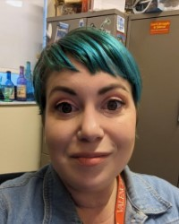

# Emilie Buckley CV

# Emilie Buckley

<<<<<<< HEAD
## Contact
- Email: [ebuckley3@valenciacollege.edu](mailto:ebuckley3@valenciacollege.edu)
- Phone: (813) 240-7773
- Office Location: Lake Nona Campus 330G
=======
### Education
* University of Central Florida  2023-Present
  Text and Technology PhD
* South Dakota State University  2017-2022
  Master of Mass Communication
* Clarion University  2012-2013
  Master of Library Science
* Governors State University  2009-2011
  Interdisciplinary Social Science
* College of Dupage 2004-2006
  General Studies
>>>>>>> c9453e595f2b499b1eaf2fd88d11a64a0cd80b72

## About Me
I'm a seasoned academic librarian with over ten years of experience. I'm currently at Valencia College as a tenured faculty librarian as well as a new student experience and speech instructor. Past institutions I've worked at include the University of Central Florida and Hillsborough Community College. I'm currently a PhD student at the University of Central Florida in the Text and Technology program. My past educational experience includes a master of mass communication at South Dakota State University and a master of library science at Clarion University.

## Education
- University of Central Florida, Text and Technology PhD, 2023-Present
- South Dakota State University, Mass Media Communication, 2017-2022
- Clarion University, Master of Library Science, 2012-2013
- Governors State University, Interdisciplinary Studies, 2009-2011
- College of DuPage, General Studies, 2004-2006

## Employment
- Valencia College, Faculty Librarian, 2017-Present
- University of Central Florida, Librarian, 2016-2017
- Hillsborough Community College, Librarian, 2014-2016
- Self-Determination Theory Institute, Research Assistant, Contractor, 2014-2014
- Hillsborough County Public Library System, Library Technical Assistant, 2010-2012

## Research Interests
- Media and culture studies
- Queer studies
- Game Studies

## Conference Presentations
- Undercover Librarian: Experiencing Biology From the Student Perspective, Florida Association of College and Research Libraries, 2022
- AI in the Classroom, Valencia College Learning Day, 2022
- Teaching Open Education Resources Through Library Partnerships, Association of College and Research Libraries OER Conference, 2021

## Skills
- Academic research
- Teaching, Student Success Skills, Speech
- Digital art
- Instructional design
- Creative Thinking

## Certifications
- Open Education Resources Institute, Association of College and Research Universities, 2021
- LGBTQ+ Safe Zone Training, Valencia College, 2020
- Destinations, Creativity in the Classroom and Beyond, 2018

## Awards
- Outstanding Mass Media Communication Student, South Dakota State University, 2022
- Tenure, Valencia College, 2022

## Find Me Online
- [LinkedIn](https://www.linkedin.com/in/emiliebuckley/)

